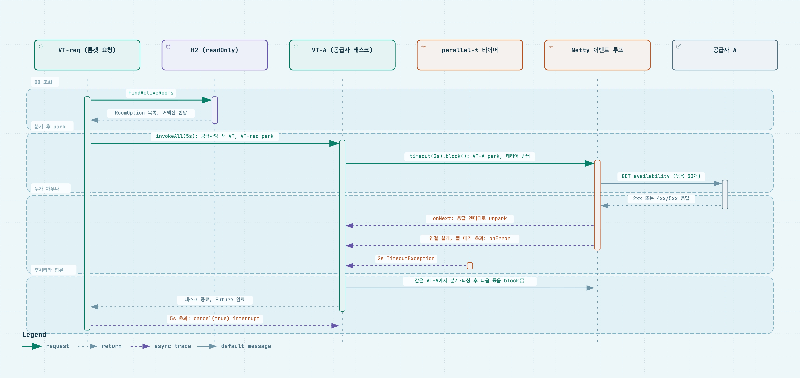

# trip - 최영민 

여러 숙박 공급사의 상품을 하나의 모델로 통합해, 날짜와 인원으로 한 번에 검색하는 API 서버.

## 개요

숙박 공급사는 저마다 다른 방식으로 상품을 표현한다. 같은 객실이라도 A는 1박 요금과 세액을 날짜별로 나눠 주고, B는 기간 전체 총액을 세금 포함으로 한 번에 준다. 실패를 알리는 방법도 다르다. A는 HTTP 상태 코드로 알리지만, B는 장애 상황에서도 HTTP 200을 주고 본문 `resultCode`로만 알린다.

### 표준 숙박 상품 모델

| 항목 | 규약 |
|---|---|
| 숙소 | `stayId` (UUID, 내부 숙소 식별자) · `stayName` |
| 객실 타입 | `roomTypeId` (UUID, 내부 객실 타입 식별자) · `roomTypeName` |
| 식별자 | **공급사 코드는 노출하지 않음.** 같은 공급사 상품은 항상 같은 ID, 공급사가 다르면 같은 숙소여도 다른 ID |
| 인원 | `maxOccupancy` (int) — 객실 1실 기준, 성인+아동 합산 |
| 재고 | **`availableRooms` (int) — 요청 기간 전체를 예약할 수 있는 객실 수. `0`이면 예약 불가지만 응답에 포함** |
| 요금 | **`totalPrice` (long) — 숙박 기간 전체, 세금 포함 총액** |
| 통화 | `currency` — ISO 4217 코드 (`KRW`, `USD` 등), 환산하지 않음 |
| 조식 | `breakfastIncluded` (boolean) — 요금에 조식이 포함되는지 |
| 출처 | `supplier` (`A` / `B`) |
| 부분 실패 | `failures[]` — 실패한 공급사마다 `supplier` · `type`(실패 분류) · `code`(원본 코드). 전부 성공이면 빈 배열 |

필드별 상세와 공급사 필드 매핑은 [docs/domain-model.md](docs/domain-model.md).

## 기술 스택

| 구분 | 사용 |
|---|---|
| 언어·런타임 | Java 25 (가상 스레드) |
| 프레임워크 | Spring Boot 4.1 (MVC) |
| 외부 호출 | Spring WebClient (Reactor Netty) |
| 영속성 | Spring Data JPA, H2 (파일 모드) |
| 견고성 | Resilience4j (서킷 브레이커·재시도) |
| 문서화 | springdoc-openapi 3.0.0 |
| 빌드 | Gradle 멀티 모듈 |

## 빠른 시작

JDK 25가 필요

공급사는 같은 저장소의 Mock 모듈을 호출

```bash
# 1) 공급사 Mock (9090) 
./gradlew :mock-supplier:bootRun

# 2) 애플리케이션 (8080)
./gradlew bootRun
```

```bash
# 3) 검색
curl "http://localhost:8080/api/v1/stays/search?checkIn=2026-10-01&checkOut=2026-10-04&adults=2&children=0"
```

- Swagger UI — <http://localhost:8080/swagger-ui.html>
- OpenAPI 문서 — <http://localhost:8080/v3/api-docs>
- H2 파일은 `./data/trip.mv.db`로 만들어진다. 스키마는 `src/main/resources/schema.sql`이고 JPA는 `validate`만 한다.

### 빌드와 테스트

```bash
./gradlew build            # 컴파일 + 단위 테스트 + 통합 테스트
./gradlew test             # 단위 테스트
./gradlew integrationTest  # @IntegrationTest 통합 테스트
```

## 프로젝트 구조

```
trip/
├── src/main/java/com/trip/
│   ├── stay/          숙소 도메인 (검색·숙소 목록 조회)
│   │   ├── controller/    요청 검증, 응답 변환
│   │   ├── business/      흐름 조립 (StayService)
│   │   ├── implement/     매핑 저장·조회 (StayManager, RoomTypeManager)
│   │   ├── dataaccess/    엔티티와 리포지토리
│   │   └── vo/            RoomOption → SearchedRoom
│   ├── supplier/      공급사 연동 경계
│   │   ├── a/ b/          공급사별 클라이언트와 응답 DTO
│   │   ├── global/        공통 호출기, 병렬 실행, 서킷 브레이커, 재시도
│   │   └── vo/            공급사 입력 모델
│   ├── support/       공통 예외·응답·값 타입
│   └── config/        WebClient, Executor, Swagger
└── mock-supplier/     공급사 A·B Mock (별도 모듈, 9090)
```

계층은 `controller → business → implement → dataaccess` 한 방향이고, 공급사 연동은 `com.trip.supplier`로 떼어 **도메인 → supplier 한 방향**으로만 의존한다. 공급사 응답 DTO는 `supplier` 패키지 밖으로 나가지 않는다.

___

## 설계 의사결정 

1. [요금을 날짜별로 쪼개지 않고 숙박 기간 총액 하나로 둔 이유는?](#1-요금을-날짜별로-쪼개지-않고-숙박-기간-총액-하나로-둔-이유는)
2. [기준을 세금 포함 총액으로 잡은 이유는?](#2-기준을-세금-포함-총액으로-잡은-이유는)
3. [A만 주는 날짜별 단가·세액을 살리지 않고 버린 이유는?](#3-a만-주는-날짜별-단가세액을-살리지-않고-버린-이유는)
4. [내부 식별자를 순번이 아니라 앱에서 만드는 UUID로 둔 이유는? 순번을 버린 대가는?](#4-내부-식별자를-순번이-아니라-앱에서-만드는-uuid로-둔-이유는-순번을-버린-대가는)
5. ["같은 공급사 상품은 항상 같은 식별자"를 무엇이 보장하는가?](#5-같은-공급사-상품은-항상-같은-식별자를-무엇이-보장하는가)
6. [유일 키를 (공급사, 숙소 코드)·(숙소, 객실 코드)로 잡은 이유는? JPA 연관관계 없이 FK 제약만 둔 이유는?](#6-유일-키를-공급사-숙소-코드숙소-객실-코드로-잡은-이유는-jpa-연관관계-없이-fk-제약만-둔-이유는)
7. [숙소·객실 목록을 매번 호출하는 게 아니라 앱 기동 1회 / 매일 새벽 4시 스케줄러 로 호출하는 이유는?](#7-숙소객실-목록을-매번-호출하는-게-아니라-앱-기동-1회--매일-새벽-4시-스케줄러-로-호출하는-이유는)
8. [연박 검색에서 예약 가능 객실 수를 어떻게 판정하는가? 0인 상품은 응답에서 빼는가?](#8-연박-검색에서-예약-가능-객실-수를-어떻게-판정하는가-0인-상품은-응답에서-빼는가)
9. [숙소 코드 50개 제한 아래에서 공급사는 병렬, 묶음은 순차로 부르는 이유는? 숙소가 수천 개가 되면?](#9-숙소-코드-50개-제한-아래에서-공급사는-병렬-묶음은-순차로-부르는-이유는-숙소가-수천-개가-되면)
10. [부분 실패를 HTTP 상태가 아니라 200 본문 `failures[]` 배열로 표현한 이유는?](#10-부분-실패를-http-상태가-아니라-200-본문-failures-배열로-표현한-이유는)
11. [모든 공급사가 실패하면 200이 아니라 502를 내는 이유는? 실패 목록을 `data`에 실은 이유는?](#11-모든-공급사가-실패하면-200이-아니라-502를-내는-이유는-실패-목록을-data에-실은-이유는)
12. [A와 B의 같은 숙소를 합치지 않고 따로 노출한 이유는?](#12-a와-b의-같은-숙소를-합치지-않고-따로-노출한-이유는)
13. [신규 공급사를 추가할 때 어디를 고쳐야 하는가?](#13-신규-공급사를-추가할-때-어디를-고쳐야-하는가)
14. [WebFlux를 택하지 않은 이유는? 가상 스레드가 WebFlux의 이점을 어디까지 대체하고, MVC를 택한 대가는?](#14-webflux를-택하지-않은-이유는-가상-스레드가-webflux의-이점을-어디까지-대체하고-mvc를-택한-대가는)
15. [연결 1s·응답 2s·전체 5s는 어떻게 정한 값인가? 개별 타임아웃과 별도로 전체 상한을 둔 이유는?](#15-연결-1s응답-2s전체-5s는-어떻게-정한-값인가-개별-타임아웃과-별도로-전체-상한을-둔-이유는)
16. [A의 4xx/5xx, B의 `resultCode`, 타임아웃, 연결 실패를 하나의 분류로 묶은 이유는? 분류 축을 무엇으로 잡았는가?](#16-a의-4xx5xx-b의-resultcode-타임아웃-연결-실패를-하나의-분류로-묶은-이유는-분류-축을-무엇으로-잡았는가)

---

## 1. 요금을 날짜별로 쪼개지 않고 숙박 기간 총액 하나로 둔 이유는?

### 상황

A는 날짜별 1박 단가와 세액을 나눠 주고, B는 숙박 기간 전체 총액만 세금 포함으로 준다.

요금을 날짜별로 쪼개 표준에 담을지, 총액 하나로 접을지 정해야 한다.

### 선택한 구조

> 검색 결과 1건당 **숙박 기간 전체 총액**으로 보여준다.

### 다른 후보와 문제점

* **후보: 날짜별 요금으로 보여주는 경우**
  * B는 날짜별 요금이 주어지지 않으므로 임의로 날짜별 요금을 정해서 보여주면 정확한 요금이 아니기 때문에 안됨.
  * 사용자 입장에서 실제로 보고 싶은 건 금액의 최종값이라고 생각함. 
  * 연박으로 인해 가격의 변동성이 존재할 수 있지만, 궁금한 해당 날짜 범위를 다시 정해서 요청하면 된다고 생각함.

### 선택 이유

1. **두 공급사가 모두 줄 수 있는 유일한 형태** 
2. **고객이 비교하는 단위와 같음.**

📂 [`SupplierRoom.java#L12`](src/main/java/com/trip/supplier/vo/SupplierRoom.java#L12) · [`SearchedRoom.java#L17`](src/main/java/com/trip/stay/vo/SearchedRoom.java#L17)

___

## 2. 기준을 세금 포함 총액으로 잡은 이유는?

### 상황

A의 `nightlyRate`는 세금 별도이고 세액이 `taxAmount`로 따로 온다.

B의 `totalPrice`는 세금 포함이고 세액은 알려주지 않는다. 기준을 어느 쪽으로 잡을지 정해야 했다.

### 선택한 구조

> **세금 포함 총액** 

### 다른 후보와 문제점

* **후보: 세금 별도 총액을 기준으로**
  * B는 세액을 주지 않으므로 세율을 내가 가정해서 계산해야 함. 
    * 추정값으로 사용자에게 제공하는 것은 값이 달라졌을 떄 신뢰성 문제로 이어진다고 생각함.

### 선택 이유

1. **양쪽 다 손실 없이 도달할 수 있는 유일한 기준**
   * A만 계산해서 보여주면됨
2. **고객이 낼 금액과 같음** 
   * 추가 계산이 없고, 결제 단계에서 값이 갑자기 오르지 않음
3. **정책 상 세금은 포함해서 보여줘야함**

📂 [`ADailyRate.java#L11-L13`](src/main/java/com/trip/supplier/a/response/ADailyRate.java#L11-L13) · [`AAvailabilityItem.java#L39`](src/main/java/com/trip/supplier/a/response/AAvailabilityItem.java#L39) · [`BSearchItem.java#L42-L43`](src/main/java/com/trip/supplier/b/response/BSearchItem.java#L42-L43)

___

## 3. A만 주는 날짜별 단가·세액을 살리지 않고 버린 이유는?

### 상황

A만 날짜별 단가와 세액을 준다. 이 값을 선택적으로라도 살릴지 정해야 했다.

### 선택한 구조

> **표준 응답 구조에 넣지 않는다.** 총액을 계산하는 용도로만 쓰고 응답으로 내보내지 않는다. 

### 다른 후보와 문제점

* **후보: A에서 온 상품에만 날짜별 요금 포함**
  * 어떤 상품에는 있고 어떤 상품에는 없는 필드가 생겨, 공급사 차이를 감추려고 만든 통합 모델인데 차이가 생겨버림
    * 여기서 B도 채우기 위해 일수로 나누게 되면, 또 임의로 결정한 금액이라 정확하지 않음

### 선택 이유

1. **한쪽만 주는 값을 표준에 올리는 순간 나머지 한쪽은 예측값이 되어버려서**
2. **날짜별 요금을 쓰는 기능이 없음**

📂 [`AAvailabilityItem.java#L32-L43`](src/main/java/com/trip/supplier/a/response/AAvailabilityItem.java#L32-L43) · [`SupplierRoom.java#L5-L13`](src/main/java/com/trip/supplier/vo/SupplierRoom.java#L5-L13)

___

## 4. 내부 식별자를 순번이 아니라 앱에서 만드는 UUID로 둔 이유는? 순번을 버린 대가는?

### 상황

숙소·객실 타입의 내부 식별자를 DB 순번(`IDENTITY`)으로 할지 UUID로 할지, UUID라면 DB와 앱 중 어디서 만들지 정해야 했다.

### 선택한 구조

> **`java.util.UUID`, 앱에서 생성**(`@UuidGenerator`) 

### 다른 후보와 문제점

* **후보: DB 순번 ID(`IDENTITY`)**
  * 정렬 가능한게 현재 상황에서는 크게 득될게 없다고 생각함.
    * 정렬/페이지는 요구사항에 없으므로
    * 인덱스 정하는 기준도 현재 상황에서는 명확하지 않음(데이터 분포, 데이터량 등 모르기 때문)
  * `IDENTITY` 는 JDBC에서 batch 작업이 안됨.

### 선택 이유

1. **정렬 안씀**
2. **앱 생성이라 INSERT 배치가 가능**
3. **보안상 유리**

📂 [`Stay.java#L25-L28`](src/main/java/com/trip/stay/dataaccess/entity/Stay.java#L25-L28) · [`RoomType.java#L21-L24`](src/main/java/com/trip/stay/dataaccess/entity/RoomType.java#L21-L24)

___

## 5. "같은 공급사 상품은 항상 같은 식별자"를 무엇이 보장하는가?

### 상황

공급사 숙소 목록을 다시 조회해 저장해도 같은 상품이 같은 내부 식별자로 돌아와야 한다. 무엇이 이를 보장하는지 정해야 했다.

### 선택한 구조

> **DB 제약 조건 + "조회 후 재사용" 저장.**

### 선택 이유

1. 제약 조건으로 인해 애플리케이션 로직이 틀려도 DB가 중복을 거부
2. 멱등성이 보장되므로 되돌아온 숙소도 같은 행을 찾는다.

📂 [`schema.sql#L12`](src/main/resources/schema.sql#L12) · [`StayManager.java#L72-L96`](src/main/java/com/trip/stay/implement/StayManager.java#L72-L96)

___

## 6. 유일 키를 (공급사, 숙소 코드)·(숙소, 객실 코드)로 잡은 이유는? JPA 연관관계 없이 FK 제약만 둔 이유는?

### 상황

공급사 코드의 유일성 범위가 서로 다르다.
숙소 코드는 공급사 안에서만 유일하고, 객실 타입 코드는 **그 숙소 안에서만** 유일하다. 다른 숙소에 같은 객실 코드가 존재할 수 있다.

### 선택한 구조

> 숙소는 **`UNIQUE (supplier, stay_code)`**, 객실 타입은 **`UNIQUE (stay_id, room_type_code)`**. 
> 
> 객실 타입은 `@ManyToOne` 없이 `UUID stayId` 컬럼만 들고, 관계는 DDL의 `FOREIGN KEY` 제약으로만 표현한다.

### 다른 후보와 문제점

* **후보: `@ManyToOne` JPA 연관을 맺는다**
  * **지연 로딩 프록시와 N+1이 문제 우려**  

### 선택 이유

1. **유일 키가 공급사의 식별자 규칙을 지키기 위해**
2. **N+1 문제 방지**

📂 [`schema.sql#L12`](src/main/resources/schema.sql#L12) · [`schema.sql#L27-L28`](src/main/resources/schema.sql#L27-L28) · [`RoomType.java#L38-L39`](src/main/java/com/trip/stay/dataaccess/entity/RoomType.java#L38-L39)

___

## 7. 숙소·객실 목록을 매번 호출하는 게 아니라 앱 기동 1회 / 매일 새벽 4시 스케줄러 로 호출하는 이유는?

### 상황

재고·요금 API는 **숙소 코드 목록을 받아** 조회한다. 즉 어떤 숙소를 물어볼지 우리가 먼저 알고 있어야 한다. 그 목록을 매 검색마다 공급사에서 가져올지, 미리 저장하고 언제 호출할지 정해야 했다.

### 선택한 구조

> **셋 다.** 기동 시 1회 + 매일 04:00 + 수동 / 조회 시 `active` 컬럼을 기준으로 활성-비활성화 

### 다른 후보와 문제점

* **후보: 검색할 때마다 목록 API를 먼저 부른다**
  * 외부 호출이 2단계로 발생해, 목록 조회를 못하게 되면 요금 조회를 못하게 되고, 시스템 자원 고갈 위험이 있음.
  * 자주 안바뀌는 데이터이므로 매번 갱신할 필요는 없음.
* **후보: 기동 시 1회만**
  * 재배포까지 옛날 데이터
* **후보: 수동 API만**
  * 관리 부담

### 주기를 하루로 잡은 근거

* 숙소 목록은 자주 바뀌지 않는 데이터이고, 혹시 모를 변화에 대비하기 위해 사용자 수가 없는 새벽 시간에 숙소 목록 조회로 갱신하는 것이 좋다고 판단
  * 새벽 시간에 장애가 발생 시, 다음 날에 수동으로 숙소 목록 조회

### 선택 이유

1. **인원 조건까지 DB에서 걸러** 모든 객실이 인원을 못 받는 숙소는 아예 묶음에서 빠짐.
2. 목록 조회는 하루에 한번 수행할 때 재시도로도 처리해도 됨.

📂 [`StayManager.java#L35-L46`](src/main/java/com/trip/stay/implement/StayManager.java#L35-L46) · [`StaySyncScheduler.java#L21-L29`](src/main/java/com/trip/stay/controller/StaySyncScheduler.java#L21-L29) · [`application.yaml#L58-L62`](src/main/resources/application.yaml#L58-L62)

___

## 8. 연박 검색에서 예약 가능 객실 수를 어떻게 판정하는가? 0인 상품은 응답에서 빼는가?

### 상황

연박 검색에서 "예약 가능 객실 수"를 어떻게 정의할지, 그 값이 0인 상품을 응답에서 뺄지 0으로 노출할지 정해야 했다

### 선택한 구조

> **요청 기간 날짜별 `remainingRooms`의 최솟값을 구해서 0과 일치했을 때 응답값을 0으로 반환한다.** 
>
> **0인 상품도 응답에 그대로 둬서 '품절'과 처음부터 없는 상품인지를 구분 가능하게 한다.**

### 다른 후보와 문제점 — 0인 상품 처리

* **후보: 공급사 호출 전에 DB에서 잔여 0인 상품을 거른다**
  * 공급사에서 제공하는 잔여실로 판정해야함 (자주 바뀌는 값이라고 판단)
* **후보: 공급사 응답 후 0인 상품을 응답에서 뺀다**
  * 품절 상품과 존재하지 않는 상품 구분을 못함

### 선택 이유

1. **연박은 모든 날짜를 동시에 확보해야함**
2. **품절인지 없는 상품인지 구분하기 위해**

📂 [`AAvailabilityItem.java#L33-L41`](src/main/java/com/trip/supplier/a/response/AAvailabilityItem.java#L33-L41) · [`BSearchItem.java#L34-L41`](src/main/java/com/trip/supplier/b/response/BSearchItem.java#L34-L41) · [`StayManager.java#L58-L66`](src/main/java/com/trip/stay/implement/StayManager.java#L58-L66)

___

## 9. 숙소 코드 50개 제한 아래에서 공급사는 병렬, 묶음은 순차로 부르는 이유는? 숙소가 수천 개가 되면?

### 상황

재고·요금 API는 한 번에 **숙소 코드 50개**까지만 받는다. 숙소가 수천 개로 늘면 한 공급사에 수십 번 나눠 불러야 한다. 이 호출들을 어떻게 배치할지 정해야 했다.

### 선택한 구조

> **공급사 간에만 병렬**(가상 스레드 Executor에 공급사당 태스크 1개), **한 공급사 안의 묶음은 순차 루프.**

### 다른 후보와 문제점

* **후보: 묶음 응답까지 전부 병렬로 처리**
  * **동시 호출이 공급사 수 × 묶음 수** 
    * 숙소 3,000개면 공급사당 60개 묶음이라 한 번의 검색이 120개 동시 요청이 됨. 
      * 커넥션 풀(공급사당 50)을 즉시 고갈시키고 공급사의 호출 한도에 도달
  * 커넥션 풀 고갈
* **후보: 공급사도 순차로 부른다**
  * 한 공급사의 응답 속도가 느리면, 다른 공급사까지 느려지게 되므로 타임아웃 이내에 응답을 받지 못할 수 있음.

### 선택 이유

1. **공급사 병렬은 공급사끼리 격리함**
    * 한 공급사가 느리거나 죽어도 다른 공급사 응답은 전체 타임아웃 안에 받음
    * 실패도 공급사 단위로 따로 기록돼서 부분 실패로 응답 가능
2. **순차 묶음은 자원 사용량을 예측 가능하게 만듬** 
    * 공급사당 동시 1커넥션이라 동시 검색 수를 풀 크기로 예측
    * 앞 묶음이 실패하면 남은 묶음을 멈출지 한 루프 안에서 판단 가능

### 숙소가 수천 개로 늘면

지금 구조는 숙소 3,000개에서 공급사당 60번의 순차 호출이 되어 5초 예산을 넘긴다. 

> **모든 숙소를 부르지 않고, 검색 1건이 보내는 요청 수를 제한한다.** 필터 → 기준 정렬 → 상한까지만 호출.

**(1)** 검색 필터링 조건으로 후보를 줄임

**(2)** 남은 후보를 기준(인기순 등)으로 정렬

**(3)** 상한까지만 공급사에 요청
  * 검색 1건의 호출 수가 고정되어 5s 안에 끝남
  * 공급사로 가는 부하가 `동시 검색 수 × 고정 호출 수`로 예측 가능해짐

* 정렬 기준(무엇으로 인기를 셀지)과 상한 값은 실제 데이터를 보고 정함
* **후보: 묶음을 병렬로 불러 전부 조회**
  * 위에서 버린 후보와 같음. 검색 1건의 동시 호출이 묶음 수만큼 늘어나 커넥션 풀과 공급사 호출 한도를 먼저 소진함
* 캐시는 요청 수 제한 위에 얹어 호출을 더 줄이는 선택 사항

📂 [`SupplierStayCodes.java#L10-L39`](src/main/java/com/trip/supplier/vo/SupplierStayCodes.java#L10-L39) · [`SupplierDispatcher.java#L53-L59`](src/main/java/com/trip/supplier/global/SupplierDispatcher.java#L53-L59) · [`SupplierDispatcher.java#L78-L94`](src/main/java/com/trip/supplier/global/SupplierDispatcher.java#L78-L94)

___

## 10. 부분 실패를 HTTP 상태가 아니라 200 본문 `failures[]` 배열로 표현한 이유는?

### 부분 실패를 왜 전체 실패로 처리하지 않나?

   * 부분 실패를 했어도 사용자에게 아무 데이터를 반환하지 않는 것보단, 성공 응답이라도 보여지도록 하는 것이 시스템적 오류가 빈번히 일어난다고 판단을 하는 것을 방지하기 위해

### 상황

검색은 한 번에 공급사 N곳으로 나가는 fan-out 구조라 "A는 성공, B는 실패"가 정상적으로 일어난다. 이 상태를 HTTP로 어떻게 표현할지 정해야 했다.

### 선택한 구조

> **200 + 본문 `{ rooms[], failures[] }`.** `failures[]` 한 줄은 `(supplier, type, code)`이고 **공급사당 한 건**이다. 묶음 일부만 실패해도 그 공급사를 실패로 표시하되, 성공한 묶음의 상품은 `rooms[]`에 그대로 남는다.

### 다른 후보와 문제점

* **후보: 실패를 예외로 올려 HTTP 상태로 알린다**
  * **성공한 공급사의 결과까지 버려짐** 
  * **HTTP 상태는 하나뿐이라 일부 성공을 표현할 수 없음**

### 묶음 일부만 실패해도 공급사를 실패로 표시하는 이유

* 고객이 알아야 할 사실은 **"이 공급사의 결과가 완전하지 않다"** 는 것 하나다. 어느 묶음이 빠졌는지는 내부 사정이고, 불완전한 목록을 완전한 것처럼 주지 않는 것이 핵심이다.

### 선택 이유

1. **검색은 성공·실패로 나누지 않음** 
     * 실패를 예외가 아니라 값으로 다뤄야 부분 성공을 표현할 수 있다.
3. **값 타입을 새로 만들지 않았다** — 예외가 이미 같은 세 필드를 들고 있어 `toFailure()`가 그대로 변환한다.

📂 [`StaySearchResponse.java#L7-L12`](src/main/java/com/trip/stay/controller/response/StaySearchResponse.java#L7-L12) · [`SupplierCallException.java#L27-L30`](src/main/java/com/trip/support/exception/supplier/SupplierCallException.java#L27-L30) · [`StayController.java#L31-L35`](src/main/java/com/trip/stay/controller/StayController.java#L31-L35)

___

## 11. 모든 공급사가 실패하면 200이 아니라 502를 내는 이유는? 실패 목록을 `data`에 실은 이유는?

### 상황

부분 실패를 200으로 표현하기로 했다면, **전부** 실패했을 때도 200이어야 하는지 정해야 했다.

### 선택한 구조

> **502.** 판정은 호출한 공급사 수와 실패 카운트한 공급사 수가 같을 때

### 다른 후보와 문제점

* **후보: `rooms: []` + `failures[]`로 200을 준다**
  * **"검색 성공, 결과 0건"과 구별되지 않음** 
    * `failures`의 길이를 직접 세어 판단해야 함  
* **후보: "상품 0건 + 실패 1건 이상"이면 502**
  * 한 공급사가 정상적으로 0건을 주고 다른 하나가 실패한 경우에도 502가 될때는 전체 실패가 아니라 부분 실패임
* **후보: 첫 실패 예외를 그대로 다시 던진다**
  * **공급사 하나의 정보만 남게 되므로 다른 공급사의 실패 원인을 모름** 

### 실패 목록을 `data`에 실은 이유

502만으로는 **왜** 실패했는지 알 수 없다. 공급사별 분류와 원본 코드가 함께 있어야 호출자가 재시도할지 판단하고, 로그 없이 응답만으로 원인을 좁힐 수 있다. 

### 선택 이유

1. **결과 0건과 장애는 다른 부류.**

📂 [`SupplierDispatchResult.java#L16-L18`](src/main/java/com/trip/supplier/vo/SupplierDispatchResult.java#L16-L18) · [`StayService.java#L38-L40`](src/main/java/com/trip/stay/business/StayService.java#L38-L40) · [`ErrorType.java#L31`](src/main/java/com/trip/support/exception/ErrorType.java#L31)

___

## 12. A와 B의 같은 숙소를 합치지 않고 따로 노출한 이유는?

### 상황

A의 한 숙소와 B의 한 숙소가 실제로는 같은 숙소·같은 객실일 수 있다. 그런데 **그 사실을 알려주는 공통 키가 스펙에 없다.** 하나로 합칠지 각각 노출할지 정해야 했다.

### 선택한 구조

> **합치지 않는다.** 공급사가 다르면 내부 식별자도 다른 두 상품으로 따로 노출하고, 컬럼 기준으로 명확히 같은 숙소를 찾을 수 없음 (공통 키가 없기 때문) 

### 합치려면 무엇을 기준으로 써야 하고, 그 기준이 왜 불안한가

   * 공통 키가 없으니 **숙소명·객실 구성·주소 같은 값으로 추정**해야 한다.

### 조건이 다른 상품을 같은 상품이라 부를 수 있는가

**부를 수 없다.** 
 * 같은 객실이라도 조건에 따라 가격이 달라진다. 
   * 조건의 여부에 따라 사용자가 선택할 수 있는 경우의 수는 달라지게 된다.
   * 상품을 팔아야하는 서비스는 구매할 수 있는 선택지를 여러 개 열어 두는 것이 맞다고 생각한다.

### 다른 후보와 문제점

* **후보: 이름 유사도로 합치고 먼저 도착한 쪽을 남긴다**
  *  **같은 요청이 매번 다른 답을 줄 수 있도 있음** 
* **후보: 공급사 우선순위를 고정해 합친다(A 우선 등)**
  * **항상 하나의 공급사 정보만 보여지기 때문에 부적절**

### 선택 이유

1. **틀렸을 때의 대가가 비대칭이다** — 안 합쳐서 생기는 손해는 목록 길이, 잘못 합쳐서 생기는 손해는 오예약이다.
2. **합치면 조건 차이가 사라진다** — 고객이 비교할 정보를 서버가 미리 버리는 셈이다.

📂 [`RoomKey.java#L6-L14`](src/main/java/com/trip/stay/vo/RoomKey.java#L6-L14) · [`StayManager.java#L48-L52`](src/main/java/com/trip/stay/implement/StayManager.java#L48-L52)

___

## 13. 신규 공급사를 추가할 때 어디를 고쳐야 하는가?

### 상황

공급사가 추가될 때 코드를 어디까지 고쳐야 하는지 정해야 했다.

### 선택한 구조

> **`SupplierClient` 인터페이스를 구현하고 `List<SupplierClient>`로 주입받는다.** 비즈니스·컨트롤러에는 공급사 분기가 없음.

### 공급사 C를 추가할 때 손댈 곳

| 위치 | 하는 일 |
|---|---|
| `supplier/Supplier` | enum에 `C` 추가 |
| `supplier/c/SupplierCClient` | `SupplierClient` 구현. 요청 조립과 성공·실패 판정 |
| `supplier/c/response/` | C 응답 record와 표준 VO 변환 |
| `config/supplier/WebClientConfig` | C 전용 커넥션 풀과 `WebClient` 빈 |
| `application.yaml` | `supplier.endpoints.C` 주소와 키 |

* 도메인, `SupplierDispatcher`, 서킷·재시도, 응답 형식은 고치지 않음
  * 새 빈은 `List<SupplierClient>`에 자동으로 들어가 병렬 호출 대상이 됨
  * 서킷·재시도는 enum 값을 돌면서 만들어짐

### 다른 후보와 문제점

* **후보: `WebClient` 하나를 공급사끼리 공유**
  * 커넥션 풀도 같이 써서, 한 공급사가 풀을 다 쓰면 다른 공급사 호출까지 대기에 걸림
* **후보: 팩토리로 `WebClient`를 동적으로 생성**
  * 공급사별로 어떤 설정을 쓰는지 설정 클래스에서 바로 안 보임

### 선택 이유

1. **기존 공급사 코드는 건드리지 않고 추가만 함**
2. **Spring 컬렉션 주입으로 등록이 끝나서 레지스트리를 따로 만들 필요 없음**

📂 [`SupplierClient.java#L11-L19`](src/main/java/com/trip/supplier/SupplierClient.java#L11-L19) · [`Supplier.java#L3-L5`](src/main/java/com/trip/supplier/Supplier.java#L3-L5) · [`WebClientConfig.java#L21-L41`](src/main/java/com/trip/config/supplier/WebClientConfig.java#L21-L41) · [`application.yaml#L31-L38`](src/main/resources/application.yaml#L31-L38)

___

## 14. WebFlux를 택하지 않은 이유는? 가상 스레드가 WebFlux의 이점을 어디까지 대체하고, MVC를 택한 대가는?

### 상황

여러 공급사를 동시에 호출해야 한다. 외부 호출은 `WebClient`로 하되, 웹 계층까지 리액티브로 갈지 정해야 했다.

### 선택한 구조

> **Spring MVC + 가상 스레드.** `WebClient`는 외부 호출에만 쓰고, 받은 `Mono`는 가상 스레드에서 `block()`으로 바로 값으로 바꾼다.

검색 한 건에 쓰이는 가상 스레드
* **요청 가상 스레드(VT-req)** - 1개
  * 톰캣이 만든 스레드로 DB 조회를 한 뒤 `invokeAll()`에서 전체 타임아웃(5s)까지 기다림
  * 공급사 태스크가 끝나면 결과를 합쳐 응답. 5s를 넘기면 남은 태스크를 `cancel(true)`로 interrupt
* **공급사 태스크 가상 스레드(VT-A, VT-B)** - 공급사 수만큼
  * 공급사마다 새로 만들고 태스크가 끝나면 버림
  * 묶음마다 `block()`에서 park되고, 응답·에러 상태·연결 실패·2s 타임아웃 어느 경우든 **같은 스레드가 깨어나** 분기와 파싱을 이어감
  * 소켓 I/O는 Netty 이벤트 루프가 하고, 가상 스레드는 기다렸다가 결과를 동기 코드로 처리



### 다른 후보와 문제점

* **후보: WebFlux로 전환**
  * JPA가 블로킹이라 리액티브 체인 안에서 결국 별도 스케줄러로 빼야 함. R2DBC로 가면 JPA를 못 씀
  * 예외가 어느 단계에서 났는지 스택 트레이스로 찾기 어려움

### 가상 스레드로 대체되는 것과 안 되는 것

* **대체됨**: 병목이 계산이 아니라 외부 호출 대기라서, 기다리는 동안 캐리어 스레드를 놓아주는 것만으로 스레드 고갈이 해결됨
* **대체 안 됨**: 배압, 스트리밍
  * 응답을 한 번에 받아 한 번에 내보내는 구조라 필요 없음
  * 배압 역할은 커넥션 풀 크기와 풀 대기 타임아웃이 대신함

### MVC를 택한 대가

* 동시 검색 수의 상한이 커넥션 풀 크기(50)에 묶임
* `block()`은 가상 스레드 위에서만 불러야 한다는 제약을 계속 지켜야 함

### 선택 이유

1. **병목이 대기라서 가상 스레드로 충분함**
2. **동기 코드라 읽기 쉬움**
   * 타임아웃·취소·부분 실패가 일반 제어 흐름으로 표현됨
   * 예외가 어느 공급사·묶음에서 났는지 스택으로 바로 보임
   * Resilience4j를 동기 API 그대로 씀
3. **JPA를 그대로 씀**

📂 [`application.yaml#L27-L29`](src/main/resources/application.yaml#L27-L29) · [`ExecutorConfig.java#L11-L14`](src/main/java/com/trip/config/supplier/ExecutorConfig.java#L11-L14) · [`build.gradle#L29-L30`](build.gradle#L29-L30)

___

## 15. 연결 1s·응답 2s·전체 5s는 어떻게 정한 값인가? 개별 타임아웃과 별도로 전체 상한을 둔 이유는?

### 상황

외부 호출에 상한이 없으면 응답 없는 공급사 하나가 검색 전체를 붙잡는다. 어디에 어떤 타임아웃을 걸지 정해야 했다.

### 선택한 구조

> **연결 1s, 응답 2s, 검색 전체 5s.** 풀 대기 200ms, 유휴 커넥션 30s도 둠. 값은 `application.yaml`의 `supplier.*`에 있음.

| 항목 | 값 | 설정 위치 |
|---|---|---|
| 풀 대기 | 200ms | `ConnectionProvider.pendingAcquireTimeout` |
| 연결 | 1s | 커넥터 설정 |
| 응답 | 2s | 커넥터 설정 + `Mono.timeout()` |
| 전체 | 5s | `invokeAll(tasks, 5s)` |

### 값의 근거

* **전체 5s**: 사용자가 검색 결과를 기다릴 수 있는 한계로 보고, 나머지 값을 이 안에 들어가게 맞춤
* **연결 1s**: 살아 있는 상대면 연결은 훨씬 빨리 됨. 연결에서 오래 기다릴수록 응답에 쓸 시간이 줄어듦
* **응답 2s**: 처음엔 3s였음
  * 묶음을 순서대로 부르기 때문에 최악은 `연결 + 응답 × 묶음 수`
  * 3s면 묶음 2개에서 `1 + 3 × 2 = 7s`로 전체 상한을 넘기고, 2s면 `1 + 2 × 2 = 5s`
* **풀 대기 200ms**: 풀이 비었으면 우리 쪽이 포화된 것이라 오래 기다려도 소용없음. 빨리 실패시킴
* **유휴 30s**: 상대가 먼저 끊은 커넥션을 다시 쓰지 않게 함

### 개별 타임아웃과 별도로 전체 상한을 둔 이유

* 개별 타임아웃은 HTTP 호출 한 번에만 걸림
* 검색 한 건은 공급사 여러 곳 × 묶음 여러 개를 부르므로, 개별 상한만 있으면 전체 지연이 `호출 횟수 × 개별 상한`까지 늘어남
* 전체 상한을 넘긴 태스크는 취소되고 `UNAVAILABLE / TOTAL_TIMEOUT_EXCEEDED`로 기록됨

### 다른 후보와 문제점

* **후보: 개별 타임아웃만 둠**
  * 묶음이 늘수록 전체 지연도 같이 늘어남
* **후보: 전체 상한만 둠**
  * 응답 없는 호출 하나가 5s를 다 써서, 같은 공급사의 다른 묶음을 부를 기회가 없어짐

📂 [`application.yaml#L39-L44`](src/main/resources/application.yaml#L39-L44) · [`SupplierHttpCaller.java#L29-L31`](src/main/java/com/trip/supplier/global/SupplierHttpCaller.java#L29-L31) · [`SupplierDispatcher.java#L58-L59`](src/main/java/com/trip/supplier/global/SupplierDispatcher.java#L58-L59)

___

## 16. A의 4xx/5xx, B의 `resultCode`, 타임아웃, 연결 실패를 하나의 분류로 묶은 이유는? 분류 축을 무엇으로 잡았는가?

### 상황

A는 HTTP 상태로 실패를 알리고, B는 장애여도 HTTP 200을 주고 본문 `resultCode`로만 알린다. 여기에 타임아웃·연결 실패·파싱 실패도 있다. 도메인이 이 차이를 모르게 해야 했다.

### 선택한 구조

> **내부 분류 6개로 모은다.** `BAD_REQUEST`, `AUTH`, `RATE_LIMITED`, `UNAVAILABLE`, `INTERNAL`, `MALFORMED`. 도메인에는 분류와 원본 코드 문자열만 넘김.

| 일어난 일 | 분류 | 원본 코드 |
|---|---|---|
| A가 HTTP 503 | `UNAVAILABLE` | `SERVICE_UNAVAILABLE` |
| B가 HTTP 200 + `resultCode: E503` | `UNAVAILABLE` | `E503` |
| 응답 없음 | `UNAVAILABLE` | `TIMEOUT` |
| 연결 안 됨 | `UNAVAILABLE` | `CONNECT_REFUSED`, `DNS`, `CONNECT_TIMEOUT` |
| 커넥션 풀 고갈 | `UNAVAILABLE` | `POOL_EXHAUSTED` |
| 서킷 열림 | `UNAVAILABLE` | `CIRCUIT_OPEN` |
| 401 / `E401` | `AUTH` | `UNAUTHORIZED`, `E401` |
| 429 / `E429` | `RATE_LIMITED` | `RATE_LIMIT_EXCEEDED`, `E429` |
| 본문 해석 불가 | `MALFORMED` | `UNPARSEABLE`, `EMPTY_BODY`, `NULL_DATA` |

### 분류 기준

분류를 보고 정하는 건 세 가지다. 재시도할지, 남은 묶음을 계속 부를지, 서킷 실패로 셀지. 그래서 "무슨 일이 났나"가 아니라 "그래서 어떻게 할까"를 기준으로 나눴다.

| 분류 | 재시도(숙소 목록 조회) | 남은 묶음 | 서킷 실패 집계 | 이유 |
|---|---|---|---|---|
| `UNAVAILABLE` | 함 | 중단 | 셈 | 상대가 내려감. 다음 묶음도 같음 |
| `INTERNAL` | 함 | 계속 | 셈 | 상대 오류지만 그 묶음만의 문제일 수 있음 |
| `AUTH` | 안 함 | 중단 | 안 셈 | 키 문제라 시간이 지나도 같음 |
| `RATE_LIMITED` | 안 함 | 중단 | 안 셈 | 다시 부르면 상대 부담만 늘어남 |
| `BAD_REQUEST` | 안 함 | 계속 | 안 셈 | 우리 요청 문제 |
| `MALFORMED` | 안 함 | 계속 | 안 셈 | 상대는 응답하고 있음 |

* 판정 메서드는 두 개로 나눔
  * `indicatesSupplierDown()` (`UNAVAILABLE`, `INTERNAL`): 재시도와 서킷이 씀. 시간이 지나면 해결되는가
  * `stopsRemainingBatches()` (`AUTH`, `RATE_LIMITED`, `UNAVAILABLE`): 묶음 루프가 씀. 다음 묶음도 같은 결과인가
* 하나로 합치면 틀리는 경우가 생김
  * `INTERNAL`은 재시도하지만 남은 묶음은 계속 부름
  * `AUTH`, `RATE_LIMITED`는 남은 묶음을 멈추지만 재시도하지 않음
* 묶음을 중단해도 앞서 받은 것은 버리지 않음
  * 한 공급사의 묶음을 순서대로 부르다 중간에 실패한 경우, 중단하든 계속하든 이미 받은 묶음의 상품은 그대로 응답에 실림
  * 실패는 공급사당 첫 건만 기록(`putIfAbsent`)해서, 묶음이 여러 개 실패해도 `failures[]`는 공급사당 한 줄

### 다른 후보와 문제점

* **후보: HTTP 상태 코드를 그대로 씀**
  * B의 실패가 전부 200으로 보임
  * 타임아웃·연결 실패는 상태 코드가 없음
* **후보: 원본 코드를 그대로 씀**
  * 공급사가 늘 때마다 재시도·서킷 판정 코드를 고쳐야 함
* **후보: 분류만 남기고 원본 코드는 버림**
  * `UNAVAILABLE`만으로는 타임아웃인지 503인지 서킷인지 알 수 없음
* **후보: 분류와 무관하게 남은 묶음을 항상 계속 부름**
  * 상대가 죽었으면 남은 묶음도 같은 실패인데 매번 2s씩 써서 5s를 다 씀
  * 호출 한도 초과 상태를 더 나쁘게 만듦
* **후보: 실패하면 항상 중단**
  * 특정 숙소 코드 때문에 한 묶음만 깨진 경우에도 나머지를 못 받음

### 선택 이유

1. **A의 503과 B의 200 + `E503`이 같은 방식으로 재시도되고 서킷에 집계됨**
2. **판정 코드에 공급사 분기가 없음**

📂 [`SupplierFailureType.java#L9-L14`](src/main/java/com/trip/support/exception/supplier/SupplierFailureType.java#L9-L14) · [`SupplierErrors.java#L19-L33`](src/main/java/com/trip/support/exception/supplier/SupplierErrors.java#L19-L33) · [`SupplierErrors.java#L35-L50`](src/main/java/com/trip/support/exception/supplier/SupplierErrors.java#L35-L50) · [`BResultCode.java#L22-L31`](src/main/java/com/trip/supplier/b/BResultCode.java#L22-L31)

---

## 설계 의사결정 (선택)

명세가 요구하지 않았지만 구현하면서 답해야 했던 **7개**다. 형식은 위와 같다.

17. [테스트에서 반환값과 예외만 단언하고 호출을 검증하지 않는 이유는?](#17-테스트에서-반환값과-예외만-단언하고-호출을-검증하지-않는-이유는)
18. [테스트의 기댓값을 구현 코드에서 가져오지 않는 이유는?](#18-테스트의-기댓값을-구현-코드에서-가져오지-않는-이유는)
19. [목록 항목 하나가 검증에 실패했을 때 그 항목만 빼지 않고 공급사 전체를 건너뛰는 이유는?](#19-목록-항목-하나가-검증에-실패했을-때-그-항목만-빼지-않고-공급사-전체를-건너뛰는-이유는)
20. [재시도를 숙소 목록 조회에만 건 이유는?](#20-재시도를-숙소-목록-조회에만-건-이유는)
21. [서킷 브레이커를 검색 경로에만 건 이유는?](#21-서킷-브레이커를-검색-경로에만-건-이유는)
22. [연동 상태를 무엇으로 관찰하는가? 지금의 실패 로그만으로 공급사별 성공률·지연·타임아웃 비율을 볼 수 있는가?](#22-연동-상태를-무엇으로-관찰하는가-지금의-실패-로그만으로-공급사별-성공률지연타임아웃-비율을-볼-수-있는가)
23. [요금·재고를 캐시한다면 어디까지, 얼마나 오래 둘 것인가?](#23-요금재고를-캐시한다면-어디까지-얼마나-오래-둘-것인가)

---

## 17. 테스트에서 반환값과 예외만 단언하고 호출을 검증하지 않는 이유는?

### 상황

mock을 쓰는 단위 테스트에서 협력 객체의 호출까지 `then(..).should()`·`verify(..)`로 검증할지 정해야 했다.

### 선택한 구조

> **반환값과 예외만 단언한다.** mock은 상황을 만드는 입력이지 검증 대상이 아니다. 그래서 **반환값 없는 메서드는 단위 테스트로 쓰지 않는다** — `StayManager.sync`처럼 부수효과만 있는 경로는 통합 테스트에서 DB를 다시 읽어 상태로 확인한다.

예외 하나. MockWebServer `takeRequest()`로 실제로 나간 요청의 경로·쿼리·헤더를 단언하는 것은 mock 상호작용이 아니라 공급사가 받는 계약이라 그대로 쓴다.

### 다른 후보와 문제점

* **후보: 호출까지 검증**
  * 구현의 협력 구조가 계약으로 굳음. 같은 결과를 내는 다른 조립으로 바꾸면 동작이 멀쩡한데 테스트가 깨짐
  * 반대로 결과가 틀려도 호출만 맞으면 통과함
* **후보: 부수효과 경로를 mock으로 단위 테스트**
  * 저장이 실제로 반영됐는지는 확인하지 못하고 "불렀다"만 남음

### 선택 이유

1. **테스트가 거는 제약이 결과에만 걸림.** 내부 조립은 자유롭게 바꿀 수 있음
2. **부수효과는 상태로 확인함.** 목록에서 사라진 객실 타입이 검색 후보에서 빠지는지, 다시 나타나면 돌아오는지를 `sync` 뒤 조회 결과로 단언

📂 [`StayManagerIntegrationTest.java`](src/test/java/com/trip/stay/integration/StayManagerIntegrationTest.java) · [`SpringTest.java`](src/test/java/com/trip/support/SpringTest.java)

___

## 18. 테스트의 기댓값을 구현 코드에서 가져오지 않는 이유는?

### 상황

케이스와 기댓값을 어디서 가져올지 정해야 했다. 구현을 열어 분기와 상수를 보고 만드는 게 가장 빠르다.

### 선택한 구조

> **`@DisplayName`의 한글 문장이 명세다.** 스펙에서 정상·경계·예외 상황을 문장으로 먼저 뽑고, 그 문장만으로 given·when·then을 구성한다. 구현에서 봐도 되는 것은 호출에 필요한 시그니처(클래스·메서드 이름, 파라미터·반환 타입, `ErrorType` 이름)뿐이다.

* 문장이 주장하는 결과는 모두 단언하고, 문장에 없는 조건·결과는 단언하지 않는다
* 경계는 정확히 그 경계값을 쓴다. 문장이 "50개면"이면 50, "50개를 넘으면"이면 51
* 문장만으로 입력이나 기댓값을 정할 수 없으면 구현을 열지 않고 스펙으로 돌아간다

### 다른 후보와 문제점

* **후보: 구현을 읽고 케이스와 기댓값을 도출**
  * 현재 출력과만 일치하는 기댓값이 생김. **버그를 정답으로 고정해, 그 버그로 인한 회귀를 영원히 잡지 못함**
* **후보: 통과 여부만 확인**
  * `isNotNull()`, `is4xxClientError()`처럼 절대 실패할 수 없는 단언이 남음

### 선택 이유

1. **테스트가 구현이 아니라 명세를 검증함**
2. **`@DisplayName`을 테스트에 맞춰 고치지 않음.** 단언과 어긋나면 이름이 아니라 단언을 고침
3. **작성 절차와 안티패턴 체크리스트를 문서로 고정하고, 작성 뒤 별도 컨텍스트에서 검토함**

📂 [`test-write/SKILL.md`](.claude/skills/test-write/SKILL.md) · [`test-antipatterns.md`](.claude/skills/test-write/references/test-antipatterns.md) · [`test-review.md`](.claude/agents/test-review.md)

___

## 19. 목록 항목 하나가 검증에 실패했을 때 그 항목만 빼지 않고 공급사 전체를 건너뛰는 이유는?

### 상황

목록 응답의 항목 하나가 검증(빈 코드, 빈 이름, 최대 인원 1 미만)에 걸렸을 때, 그 항목만 뺄지 그 공급사의 목록 반영 전체를 건너뛸지 정해야 했다.

### 선택한 구조

> **그 공급사의 목록 반영을 건너뛰고 기존 DB 값을 유지한다.** `SupplierStay`·`SupplierRoomType` 생성자가 검증하고, 예외가 나면 변환 전체가 멈춤.

### 다른 후보와 문제점

* **후보: 잘못된 항목만 빼고 반영**
  * 빠진 숙소가 목록에서 사라진 숙소로 처리돼 `active=false`가 됨. 공급사 응답 오류 하나로 팔던 숙소가 검색에서 빠짐

### 선택 이유

1. **잘못 반영하는 것보다 하루 늦게 반영하는 게 나음**
2. **목록은 자주 안 바뀌어서 다음 숙소 목록 조회로 충분함**

📂 [`SupplierStay.java#L9-L20`](src/main/java/com/trip/supplier/vo/SupplierStay.java#L9-L20) · [`StayService.java#L56-L59`](src/main/java/com/trip/stay/business/StayService.java#L56-L59)

___

## 20. 재시도를 숙소 목록 조회에만 건 이유는?

### 상황

공급사 호출은 일시적으로 실패할 수 있다. 재시도를 걸지, 건다면 어느 경로에 걸지 정해야 했다.

### 선택한 구조

> **목록 조회에만 건다.** 

### 다른 후보와 문제점

* **후보: 검색에도 재시도** 
  * 부하가 걸린 공급사에 요청을 더 보내기 때문에 리소스 자원 고갈 우려
  * 자주 발생하는 API에 재시도 정책이 불필요하다고 생각.
    * 다시 요청하면 되기 때문에
* **후보: 두 공급사가 모두 실패했을 때만 재시도**
  * 둘 다 실패하는 건 전체 장애나 우리 네트워크 문제일 가능성이 커서 재시도가 성공할 확률이 가장 낮음
* **후보: 재시도 없음**
  * 숙소 목록 조회는 다음 실행이 하루 뒤라, 한 번 실패하면 하루 동안 갱신이 안 됨

### 선택 이유

1. **다음 기회까지의 간격이 다름.** 검색은 곧 다시 들어오고, 숙소 목록 조회는 하루 뒤
2. **숙소 목록 조회는 사용자가 기다리는 요청이 아님.** 기동 시 실패해도 기동이 최대 8초 늦어질 뿐
3. **재시도까지 실패하면 기존 매핑을 유지하고 경고 로그만 남김**

📂 [`application.yaml#L53-L56`](src/main/resources/application.yaml#L53-L56) · [`SupplierRetry.java#L56-L58`](src/main/java/com/trip/supplier/global/SupplierRetry.java#L56-L58) · [`StayService.java#L51`](src/main/java/com/trip/stay/business/StayService.java#L51)

___

## 21. 서킷 브레이커를 검색 경로에만 건 이유는?

### 상황

공급사 하나가 계속 죽어 있으면 검색마다 그 공급사를 부르고 2초를 기다린 뒤에야 응답한다.

### 선택한 구조

> **검색 경로에만, 공급사별로 건다.** 

### 목적

* 공급사의 장애를 해결하는 게 아닌, 죽은 공급사를 기다리는 시간을 줄임

### 설정값 근거

* **최소 호출 10**: 한두 번 실패로 열리지 않게 함
* **열림 유지 10s**: 검색은 요청이 잦아서 반열림 확인이 실제 검색 요청으로 들어옴. 길게 잡으면 살아난 공급사 상품이 그동안 빠짐
* **`BAD_REQUEST`, `MALFORMED`는 안 셈**: 상대 상태가 아니라서

### 다른 후보와 문제점

* **후보: 숙소 목록 조회에도 검**
  * 하루 1~2회 호출이라 최소 호출 10을 채우는 데 며칠 걸림
* **후보: 열렸을 때 별도 오류 응답**
  * 클라이언트가 서킷이라는 내부 사정을 알아야 함

### 열렸을 때 동작

* 호출하지 않고 `UNAVAILABLE / CIRCUIT_OPEN`을 던짐
* 기존 부분 실패 흐름을 그대로 탐. `failures[]`에 한 줄, 남은 묶음 중단, 양쪽 다 열리면 502

### 선택 이유

1. **검색은 호출이 잦아서 서킷 판단에 필요한 표본이 쌓임**
2. **응답 형식이 바뀌지 않음**

📂 [`application.yaml#L46-L51`](src/main/resources/application.yaml#L46-L51) · [`SupplierCircuitBreaker.java#L44-L49`](src/main/java/com/trip/supplier/global/SupplierCircuitBreaker.java#L44-L49) · [`SupplierDispatcher.java#L80`](src/main/java/com/trip/supplier/global/SupplierDispatcher.java#L80)

___

## 22. 연동 상태를 무엇으로 관찰하는가? 지금의 실패 로그만으로 공급사별 성공률·지연·타임아웃 비율을 볼 수 있는가?

### 상황

공급사 호출은 실패를 전제로 만들었고, 실패는 이미 분류와 구조화 로그로 남긴다. 이것만으로 공급사별 **성공률·응답 지연·타임아웃 비율**까지 볼 수 있는지, 아니면 지표를 따로 둬야 하는지 정해야 했다.

### 지금 구현된 것 — 실패 로그

모든 로그는 `[카테고리 : 상세]: key=value | key=value` 형식이고, 공급사 호출 실패에는 항상 `supplier`, `type`, `code`가 함께 찍힌다.

| 로그 | 레벨 | 언제 |
|---|---|---|
| `[공급사 재고/요금 호출 : 묶음 실패]` | warn | 묶음 호출이 분류된 실패로 끝남 (`type`, `code`, `stayCodeCount`) |
| `[공급사 재고/요금 호출 : 전체 타임아웃 초과]` | warn | 5s 안에 공급사 태스크가 끝나지 않음 |
| `[공급사 재고/요금 호출 : 예기치 못한 오류]` | error | 분류되지 않은 예외 (스택 포함) |
| `[공급사 서킷 브레이커 : 상태 전이]` | warn | CLOSED ↔ OPEN ↔ HALF_OPEN, `failureRate` 포함 |
| `[공급사 서킷 브레이커 : 호출 차단]` | warn | 서킷이 열려 호출하지 않음 |
| `[공급사 호출 재시도 : 대기 후 재시도]` | warn | 목록 조회 재시도 |
| `[숙소 동기화 : 완료 / 목록 조회 실패 / 항목 검증 실패 / 저장 실패]` | info / warn / error | 목록 반영 결과 |

실제 출력 (A 무응답, B 장애):

```
[공급사 재고/요금 호출 : 묶음 실패]: supplier=B | type=UNAVAILABLE | code=E503 | stayCodeCount=1
[공급사 재고/요금 호출 : 묶음 실패]: supplier=A | type=UNAVAILABLE | code=TIMEOUT | stayCodeCount=2
```

### 로그로 되는 것과 안 되는 것

* **되는 것 — "무엇이 왜 실패했나"**
  * 실패 한 건의 공급사·분류·원본 코드를 바로 볼 수 있음
  * `code=TIMEOUT` 건수를 세면 **타임아웃이 몇 번 났는지**는 알 수 있음
  * 서킷 상태 전이 로그로 **공급사가 언제 죽고 언제 살아났는지** 알 수 있음
* **안 되는 것 — "얼마나 자주, 얼마나 느린가"**
  * **성공은 로그를 남기지 않는다.** 분모(전체 호출 수)가 없어서 성공률·타임아웃 비율을 계산할 수 없음
  * **호출 시간을 기록하지 않는다.** 서킷 브레이커가 내부적으로 호출 시간을 재지만 밖으로 내보내지 않음. 타임아웃 직전까지 느려지는 "죽지는 않았는데 느린" 공급사를 볼 수 없음
  * 로그는 텍스트라 비율·백분위를 내려면 수집기에서 파싱·집계해야 함

즉, 지금의 로그는 **원인 추적용**이고 **추세 관찰용 지표는 아니다.** 지표는 로그 위에 따로 얹어야 한다.

### 설계 (미구현)

> **공급사 호출 1회마다 결과와 소요 시간을 지표로 남긴다.** 실패 분류를 태그로 그대로 쓴다.

**어디서 잴까** — 공통 실행기 `SupplierHttpCaller.call()`. 모든 공급사 HTTP 호출이 여기를 지나고, 여기서 던지는 예외가 이미 `SupplierCallException(type, code)`로 분류돼 있어 공급사별 분기 없이 태그를 붙일 수 있다. 서킷 차단(`CIRCUIT_OPEN`)과 전체 타임아웃(`TOTAL_TIMEOUT_EXCEEDED`)은 호출 자체가 없으므로 `SupplierCircuitBreaker`, `SupplierDispatcher`에서 카운터만 올린다.

| 지표 (Micrometer) | 종류 | 태그 | 보는 것 |
|---|---|---|---|
| `supplier.call` | Timer | `supplier`, `operation`(stays / rooms), `outcome`(success / failure), `type`, `code` | 호출 수, 응답 지연 p50·p95·p99 |
| `supplier.call.rejected` | Counter | `supplier`, `reason`(CIRCUIT_OPEN / TOTAL_TIMEOUT_EXCEEDED) | 호출 전에 막힌 수 |
| `supplier.circuit.state` | Gauge | `supplier` | 현재 서킷 상태 (resilience4j-micrometer 바인딩) |
| `stay.search.partial` | Counter | `result`(complete / partial / all_failed) | 고객이 불완전한 결과를 받은 비율 |

* `code` 태그는 원본 코드라 값이 늘 수 있다. 공급사가 모르는 코드를 주면 `BResultCode`가 `INTERNAL`로 묶듯, 태그도 알려진 코드 목록 밖은 `OTHER`로 묶어 카디널리티를 막는다.

**요구 지표를 이렇게 계산한다**

| 요구 | 계산 |
|---|---|
| 공급사별 성공률 | `supplier.call{outcome=success}` ÷ `supplier.call` (공급사별) |
| 응답 지연 | `supplier.call{outcome=success}`의 p95·p99 |
| 타임아웃 비율 | `supplier.call{code=TIMEOUT}` ÷ `supplier.call` |

**알림 기준 (초안)** — 값은 현재 설정에서 출발한다.

| 조건 | 이유 |
|---|---|
| 5분 성공률 < 90% | 서킷(실패율 50%)이 열리기 전에 먼저 알기 위해 |
| p95 > 1.5s | 응답 타임아웃 2s에 가까워짐. 곧 타임아웃으로 바뀜 |
| 서킷 OPEN 진입 | 그 공급사 상품이 검색에서 빠지는 중 |
| `type=AUTH` 1건 이상 | 시간이 지나도 풀리지 않는 설정 문제 |
| `stay.search.partial{result=all_failed}` 발생 | 고객이 502를 받는 중 |

### 다른 후보와 문제점

* **후보: 로그만 남기고 수집기에서 집계**
  * 성공 로그를 매 호출마다 남겨야 분모가 생김. 검색 1건에 공급사 수 × 묶음 수만큼 로그가 늘어남
  * 지연을 로그 문자열에서 꺼내 백분위를 내는 건 지표보다 비쌈
* **후보: 서킷 브레이커 내부 지표만 노출**
  * 서킷은 슬라이딩 창(최근 20건)만 들고 있어 추세를 못 봄
  * 서킷 대상이 아닌 목록 조회는 잡히지 않음
* **후보: 요청 1건당 로그 한 줄로 공급사별 결과를 모아 남김**
  * 원인 추적에는 좋지만 비율·지연은 여전히 집계가 필요함

### 구현하지 않은 이유

* 이번 범위의 우선순위는 핵심 흐름과 필수 견고성(병렬·타임아웃·부분 실패·실패 판정 통일)
* 실패 분류와 공통 실행기가 이미 있어서, 지표는 `SupplierHttpCaller` 한 곳에 붙이면 되고 도메인 코드는 바뀌지 않음

📂 [`SupplierDispatcher.java#L83-L91`](src/main/java/com/trip/supplier/global/SupplierDispatcher.java#L83-L91) · [`SupplierCircuitBreaker.java#L64-L70`](src/main/java/com/trip/supplier/global/SupplierCircuitBreaker.java#L64-L70) · [`StayService.java#L52-L67`](src/main/java/com/trip/stay/business/StayService.java#L52-L67)

___

## 23. 요금·재고를 캐시한다면 어디까지, 얼마나 오래 둘 것인가?

### 캐시를 도입했을 때 구조 (설계, 미구현)

> **검색 요청이 캐시를 채우고(cache-aside), 짧은 TTL로 둔다.** 공급사 호출을 더 줄이는 용도로만 쓴다.


| 항목 | 방향 |
|---|---|
| 캐시 대상 | 공급사 요금·재고 응답. DB 후보 조회는 캐시하지 않음  |
| 채우는 주체 | 검색 요청. 사전 적재는 하지 않음 |
| 남는 키 | 실제로 검색된 키만. 자주 검색되는 키가 자연스럽게 계속 갱신됨 |
| TTL | 짧게 (수십 초 ~ 수 분). 값은 공급사 요금 변경 빈도를 보고 정함 |
| 정합성 | 검색 결과는 최대 TTL만큼 지난 값일 수 있음을 허용. 예약 단계에서 원본과 다르면 원본을 따름 |
| 스탬피드 | 따로 막지 않음 (아래) |

### 상황

숙소가 수천 개일 때의 호출 수는 요청 수 제한으로 이미 고정된다. 그 위에서 요금·재고를 캐시해 호출을 더 줄일지, 줄인다면 어떻게 채우고 얼마나 둘지 정해야 했다.

### 스탬피드를 따로 막지 않는 이유

* 스탬피드는 인기 키가 만료되는 순간 동시에 들어온 검색이 모두 캐시를 못 찾고 공급사를 호출하는 것
* 요청 수를 제한했기 때문에 검색 1건의 호출 수는 고정되어 있음
  * 만료 순간의 최악은 `동시 검색 수 × 고정 호출 수` = **캐시가 없을 때의 부하와 같음**
  * 캐시가 없어도 버티는 부하이므로, 만료 순간에 원래 부하로 잠깐 돌아갈 뿐 더 나빠지지 않음
* 단, 캐시가 있어야만 공급사 호출 한도 안에 들어오는 규모가 되면 그때는 키별로 한 요청만 호출하게 하는 등의 대비가 필요함

### 다른 후보와 문제점

* **후보: 숙소 목록과 같이 하루 TTL**
  * 숙소 목록은 숙소가 들어오고 나갈 때만 바뀌어서 하루 주기(04:00 동기화)가 맞지만, 요금·재고는 하루에도 여러 번 바뀜
  * 아침에 매진된 객실이 하루 종일 "1개 남음"으로 보이고, 들어갈 때마다 예약이 실패함
  * 24시간 캐시는 사실상 저장이라, "요금·재고는 원본이 외부에 있으니 쌓아두지 않는다"는 전제와 충돌함
* **후보: 인기 숙소를 골라 백그라운드에서 주기적으로 사전 적재**
  * 요금·재고 조회는 사용자 검색으로 자주 일어나서, 인기 키는 검색 트래픽이 이미 계속 채워줌. 적재 작업은 같은 호출을 한 번 더 하는 셈
  * 검색이 없는 키에도 공급사 호출 한도를 씀
  * 무엇을 적재할지(숙소 × 날짜 × 숙박일 수 × 인원) 미리 예측해야 함
* **후보: DB 후보 조회 결과를 캐시**
  * 응답 시간은 외부 호출이 차지해서 로컬 쿼리를 캐시해도 줄어드는 시간이 거의 없음

### 선택 이유

1. **짧은 TTL이라 "방금 본 값을 잠깐 재사용"하는 수준에 그침** — 요금·재고를 저장하지 않는다는 전제와 공존함
2. **검색 트래픽이 곧 캐시를 채우는 기준이라 예측이 필요 없음**
3. **요청 수 제한이 부하의 상한을 이미 정해서, 캐시는 보너스로만 동작함**
4. **틀려도 되는 곳(검색)과 틀리면 안 되는 곳(예약)을 나눔** — 오차는 검색에서만 허용

### 구현하지 않은 이유

* 지금 데이터(숙소 몇 개)로는 호출 수 문제가 드러나지 않음
* TTL은 실제 검색 분포와 공급사 요금 변경 빈도를 보고 정해야 해서, 근거 없이 값을 고정하지 않음

---

## 문서

- [docs/architecture.md](docs/architecture.md) — 모듈·계층 구조, 검색·목록 조회 흐름, 스레드와 타임아웃
- [docs/domain-model.md](docs/domain-model.md) — 표준 숙박 상품 모델, 공급사 필드 매핑, DB 스키마
- [docs/api.md](docs/api.md) — 검색·목록 조회 API 명세, 오류 코드, Mock 장애 재현 방법
- [docs/JOURNAL.md](docs/JOURNAL.md) — 개발 과정의 의사결정, 막힌 지점, 폐기한 대안, AI 활용 기록
- Swagger UI — <http://localhost:8080/swagger-ui.html> 
